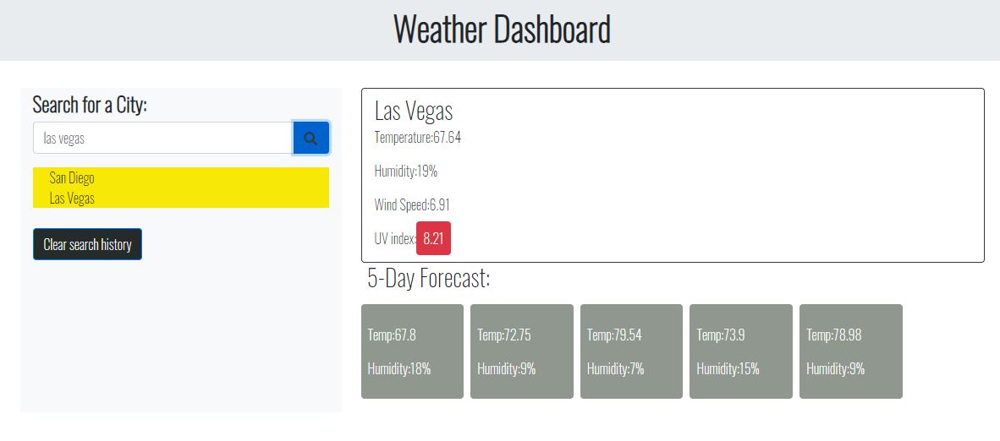

## Your Task
for this assignment, we were asked to create a weather dashboard using 3rd party API.
using the fetch method to receive response from https://openweathermap.org/api and asking for the data to be returned formatted using JSON.
while using jquery to manipulate the DOM dynamically to update real time information to display the current weather along with 5 day forcast
we will be receiving this realtime information from openweather API.

all this will happen when a user inputs the city and clicks search event, using a function.

after user submits desired search it will append search history to the bottom of the search bar this will be known as "search history" 
the search history will continue to append untill user clicks "clear search history" by usung jquery "empty" parameter. 

bootstrap was used for HTML elements along with another 3rd party API to recive icons, I later realized I did not need a third party for the icons, unfortunately time
got the best of me, but I did make the attempt. 


https://github.com/angelpena619/Weather-Dashboard


https://angelpena619.github.io/Weather-Dashboard/




Third-party APIs allow developers to access their data and functionality by making requests with specific parameters to a URL. Developers are often tasked with retrieving data from another application's API and using it in the context of their own. Your challenge is to build a weather dashboard that will run in the browser and feature dynamically updated HTML and CSS.

Use the [OpenWeather API](https://openweathermap.org/api) to retrieve weather data for cities. The documentation includes a section called "How to start" that provides basic setup and usage instructions. You will use `localStorage` to store any persistent data.

## User Story

```
AS A traveler
I WANT to see the weather outlook for multiple cities
SO THAT I can plan a trip accordingly
```

## Acceptance Criteria

```
GIVEN a weather dashboard with form inputs
WHEN I search for a city
THEN I am presented with current and future conditions for that city and that city is added to the search history
WHEN I view current weather conditions for that city
THEN I am presented with the city name, the date, an icon representation of weather conditions, the temperature, the humidity, the wind speed, and the UV index
WHEN I view the UV index
THEN I am presented with a color that indicates whether the conditions rd are favorable, moderate, or severe
WHEN I view future weather conditions for that city
THEN I am presented with a 5-day forecast that displays the date, an icon representation of weather conditions, the temperature, and the humidity
WHEN I click on a city in the search history
THEN I am again presented with current and future conditions for that city
```


